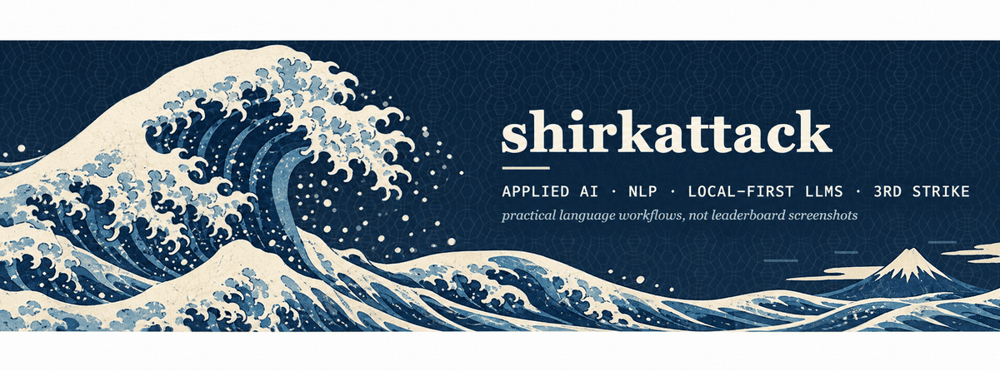
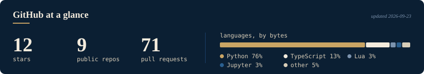

<!-- shirkattack profile README. Header (animated gif), footer and section glyphs live in ./assets. -->

> **TL;DR:** Data scientist turned applied-AI builder. Ten-plus years of Python, a PhD's worth of stubbornness, and a
> long history of pointing NLP at messy real-world text: fraud, corruption, drug seizures, crypto scams, legal complaints.
> These days I mostly build **local-first LLM tooling** (prompt optimization, evals, self-hosted inference) and, for
> balance, a **Street Fighter III engine** in Python. Powered by tacos.

---

##  What I'm About

<table>
<tr>
<td width="50%" valign="top">

### Applied AI / NLP
Retrieval, extraction, classification and evaluation pipelines that survive contact with real data. RAG, fine-tuning (LoRA / QLoRA / PEFT), DSPy prompt optimization, LLM-as-judge evals, and the MLOps glue to ship them.

### Local-first LLM infrastructure
Consumer GPU + Ollama + vLLM + a single gateway + tracing. Nothing leaves the box. Every model earns its spot with a reproducible, checksummed eval bundle or it doesn't ship.

</td>
<td width="50%" valign="top">

### AI for investigations
Formerly a Senior Data Scientist at the UN Office on Drugs and Crime. Text analytics and entity extraction for economic crime, corruption and regulatory work.

### Fighting-game engineering
Frame data, hitboxes, parries and cancels recreated in pure Python, plus a Gymnasium RL environment for *Street Fighter 3rd Strike* running on stock MAME. Because the lab work never ends.

</td>
</tr>
</table>

---

##  Projects - Stuff I'm tinkering with

###  LLM tooling & evaluation

<table>
<tr>
<td width="50%" valign="top">

#### [PromptCraft](https://github.com/shirkattack/PromptCraft)
Local, private prompt optimization with **DSPy + Ollama**. Paste a rough prompt, get a rewrite, a score and a diff. Add a small dataset and it measures candidates on held-out examples and evolves instructions from written feedback with **GEPA**, showing the lineage of every edit. No API keys, nothing leaves your machine.

`Python` `DSPy` `GEPA` `Ollama` `FastAPI`

</td>
<td width="50%" valign="top">

#### [multiturn-refusal](https://github.com/shirkattack/multiturn-refusal)
Does an assistant's earlier refusal make it more likely to refuse the *next* request? A controlled study of **refusal hysteresis**: 65 borderline prompts, byte-identical final turn, multiple conversation set-ups, a blind LLM judge, bootstrap CIs. Result of record reproduces offline from a fresh clone.

`Python` `vLLM` `RunPod` `LLM-as-judge` `Prodigy`

</td>
</tr>
<tr>
<td colspan="2" valign="top">

#### [RADRAG](https://github.com/shirkattack/RADRAG)
Retrieval-Augmented Generation from notebook experiments to a deployable FastAPI + TypeScript document-AI app on Azure OpenAI and AI Search.

`LangChain` `LlamaIndex` `FastAPI` `Azure` `TypeScript`

</td>
</tr>
</table>

###  Local-first infrastructure

<table>
<tr>
<td width="50%" valign="top">

#### [ServeShed](https://github.com/shirkattack/ServeShed)
A **local LLM workstation and on-demand server** for one Ubuntu desktop with one consumer GPU. Ollama for chat, vLLM for batch, **Bifrost** as the single gateway, **Phoenix** tracing everything. Cloud fallback: never. Every claim exercised end-to-end on real hardware and written up in ADRs.

`Docker Compose` `Ollama` `vLLM` `Bifrost` `Phoenix` `NVIDIA`

</td>
<td width="50%" valign="top">

#### [shell_yeah](https://github.com/shirkattack/shell_yeah)
Because life's too short for a boring terminal. Zsh configs, aliases, theming and the scripts I actually reach for every day.

`Zsh` `CLI` `dotfiles`

</td>
</tr>
</table>

###  Fighting games, but make it engineering

<table>
<tr>
<td width="50%" valign="top">

#### [PyKuma](https://github.com/shirkattack/PyKuma)
From frame data to fireballs. A love letter to **Street Fighter III: 3rd Strike**, written in pure Python: parries, cancels, hitboxes, frame data and that sweet self-KO energy.

`Python` `Pygame` `Frame data`

</td>
<td width="50%" valign="top">

#### [sf3-gym](https://github.com/shirkattack/sf3-gym)
A **Gymnasium RL environment** for *3rd Strike* on stock MAME. Bring your own ROM.

`Gymnasium` `MAME` `RL`

</td>
</tr>
</table>

###  NLP for investigations

<table>
<tr>
<td width="50%" valign="top">

#### [drugdetection](https://github.com/shirkattack/drugdetection)
Detecting **drug seizure information** in open-source news with Named Entity Recognition. Unstructured articles in, structured intelligence out.

`spaCy` `Transformers` `NER`

</td>
<td width="50%" valign="top">

#### [TwitterNLP](https://github.com/shirkattack/TwitterNLP)
Mapping the crypto risk landscape: a **spaCy text classifier** that flags scam and fraud discussion on Twitter. Annotated in Prodigy with active learning, weak-labelled with Snorkel, tuned with W&B sweeps.

`spaCy` `Prodigy` `Snorkel` `Weights & Biases`

</td>
</tr>
<tr>
<td colspan="2" valign="top">

#### [SpiderWire](https://github.com/shirkattack/SpiderWire)
A **Scrapy** crawler that collects open-source news worldwide for downstream analysis. Paginates politely, slow-rolls to avoid bans, exports structured data instead of chaos.

`Scrapy` `Redis`

</td>
</tr>
</table>

---

##  Tech I Actually Use

<em>Core</em> 

<em>LLMs, RAG & evals</em> 

<em>Local inference & serving</em> 

<em>NLP, annotation & scraping</em> 

<em>Dev environment</em> 

---

##  GitHub at a Glance

  

---

##  Elsewhere

**Episode 218.** Recorded at GTC 2024 on using data-centric AI and investigative analytics against economic crime and corruption. [Blog post](https://blogs.nvidia.com/blog/cleanlab-podcast/) / [SoundCloud](https://soundcloud.com/theaipodcast/cleanlabs-ai) / [Apple Podcasts](https://podcasts.apple.com/us/podcast/the-ai-podcast/id1186480811)

---

